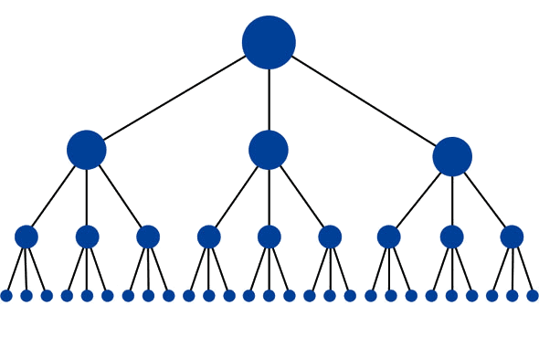
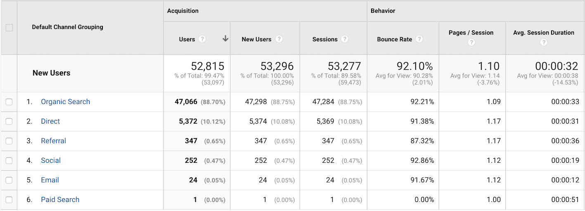

# Search Engine Optimization

How to create SEO optimized content

---

## Lets start with the basics, what is SEO?
SEO stands for Search Engine Optimization, which is the practice of increasing the quantity and quality of traffic to your website through organic search engine results.

## What goes into SEO?
To understand the true meaning of SEO, let's break that definition down and look at the parts:

__Quality of traffic.__ You can attract all the visitors in the world, but if they're coming to your site because Google tells them you're a resource for Apple computers when really you're a farmer selling apples, that is not quality traffic. Instead you want to attract visitors who are genuinely interested in products that you offer.

__Quantity of traffic.__ Once you have the right people clicking through from those search engine results pages (SERPs), more traffic is better.
Organic results. Ads make up a significant portion of many SERPs. Organic traffic is any traffic that you don't have to pay for.

source: [MOZ](https://moz.com/learn/seo/what-is-seo)

---

## But how our Master (Google) ranks content?
There are over 200 ranking factors that are used in Google's ranking algorithm!

---

## Lets focus on what matters most!

---

### Website Security and Accessibility
Having a website that can be accessed and crawled easily via Google.

A robots.txt file that tells Google where it can and can’t look for your site information.

A sitemap, which lists all your pages.

HTTPs and SSL  (light factors)

---

### How deep is your crawl Brad?

---
### Mobile Page Speed (key ranking factor)

---
### Mobile friendliness

Google’s mobile-first index is now a reality

---
### Domain Age, URL, and Authority

Domain authority counts 24% as a component in Google's search algorithm!

60% of all the sites that have a top 10 Google search ranking are 3 years old or more!

source: [MOZ](https://moz.com/learn/seo/what-is-seo)

---

### Optimized Content

On page keyword usage counts 15% as a component in Google's search algorithm!

source: [MOZ](https://moz.com/learn/seo/what-is-seo)

---

 __On page SEO usage__

First step start with the right keywords

---

[>>Enter Ubersuggest](https://app.neilpatel.com/en/ubersuggest/overview?lang=en&locId=2840&keyword=performance+appraisal)

---
Other keyword tools:

[Keyword Planner](https://ads.google.com/intl/en_uk/home/tools/keyword-planner/)

[SEMRush](https://www.semrush.com/features/)

[Keyword Sheeter](https://keywordsheeter.com/)

---
But what you do when you ran out of keyword ideas?

---
Check what the competition is doing and copy them keywords!

[>>Enter Ubersuggest Domain Search](https://app.neilpatel.com)

---

Before we get to content structure lets cover:

LSI (latent and not latex semantic indexing)

source: [BacklinkO](https://backlinko.com/hub/seo/lsi)

---

LSI keywords are conceptually related terms that search engines use to understand content.

Google will scan an entire page not just for keywords but LSI keywords too.

__Keyword:__ cold brew coffee

__LSI keywords:__ water, beans, ice, kit, recipe, grind

---

LSI Keywords are NOT synonyms.

[Google Autocomplete](https://support.google.com/websearch/answer/106230?co=GENIE.Platform%3DAndroid&hl=en) is one of the fastest and easiest ways

to uncover LSI terms to use in your content.

---

# Content structure

---

__Meta Title__

A meta title is an important part of website optimization,

and it's distinct from the headline on the page itself.

It acts as a name tag for the web page.

---

__Meta Description__

The meta description is a snippet of up to about 155 characters – a tag in HTML –

which summarizes a page's content. Search engines show the meta description

in search results mostly when the searched-for phrase is within the description,

so optimizing the meta description is crucial for on-page SEO.

---

__URL__

A URL (Uniform Resource Locator), more commonly known as a "web address",

specifies the location of a resource (such as a web page) on the internet.

The URL also specifies how to retrieve that resource, also known

as the "protocol", such as HTTP, HTTPS, FTP, etc.

---

---

__Blog structure__

A standard blogpost should have the following sections:

Title (H1 tag)

Image title and ALT attribute

Subheading (H2 tag)

Text

Inbound and outbound links

---

__Blog post structure - Best practices__

Awesome headline

Catchy picture

Amazing introduction

Main points (lead in)

Conclusion

Invitation for feedback

[Read more here](https://neilpatel.com/blog/the-ultimate-guide-to-writing-blog-posts-that-rank-in-googles-top-10/)

---
That's all good and nice but from a technical perspective

how do I optimize a blogpost good blogpost?

---

Distribute your keywords evenly

---

Have the right keyword density, you can calculate it using the formula below:

Density = ( Nkr / ( Tkn -( Nkr x ( Nwp-1 ) ) ) ) x 100

Density = your keyword density

Nkr = how many times you repeated a specific key-phrase

Nwp = number of words in your key-phrase

Tkn = total words in the analysed text

---

But, but what is the right keyword density?

# 3% give or take

---

Include the keyword in the tittle

---
Include the keyword in the meta description

---
Include the keyword in the first paragraph of the blog post

---
All image titles and Alt_image titles contain the keyword

---

URL contains the keyword

---

Internal Linking

According to MOZ the blogpost with the main keyword should have 100 internal links.

These should be build as a pyramid.

10 blogposts with 10 internal linked to a blogpost

---

Outbound Linking

Not easy to achieve but super valuable!

Use SEMRush suggestions and follow approach highlighted [here](https://neilpatel.com/blog/9-link-building-resources-thatll-increase-your-search-rankings/).

---

Blogpost media

Videos

Images

Presentation slides as images

# Visual aids add great value use a lot!

---

Great information Nik, but how do I check everything while I am writing content?

---

Don't sweat it Jo:

[Yoast](https://yoast.com/research/real-time-content-analysis/)

and

[SEOReview tools](https://www.seoreviewtools.com/content-analysis/)

will do it for you.

---

Sharing and advertising also important.

LinkedIn and Twitter best for HR SaaS!

Mention influencers and join LinkedIn communities

---

We all need to know the:

Best HR conferences

Best HR tools

Top HR influencers to follow

Top HR blogs

Top stats on HR

---

Who is the number 1 HR influencer?

---

---

# Always, always run your

# content through an SEO checker!

---

How long my blogpost should be?

---

source: [Ubersuggest](https://neilpatel.com/blog/long-blog-articles/)

---

__SEO Ranking Factors – Answer Boxes__

Google’s increasingly delivering answers via Answer Boxes, so that’s another

aspect of optimizing for better search engine rankings.

---

---

__Keyword difficulty__

Keyword difficulty (also known as keyword competition) is one of the most

important metrics you should consider when doing keyword research.

The higher is the keyword difficulty, the harder it is to rank on the

1st SERP due to a high competition of the ranking websites.

---

__Long tail keywords__

Long tail keywords are those three and four keyword phrases which are very,

very specific to whatever you are selling. You see, whenever a customer uses

a highly specific search phrase, they tend to be looking for exactly

what they are actually going to buy.

---

__RankBrain__

Google is using artificial intelligence to better rank web pages. It calls that

signal RankBrain. This includes other signals that affect

your search engine ranking. These are:

__Clickthrough rate__

__Bounce rate__

__Dwell time__

---

# PeopleGoal Domain overview

*Note: Traffic volume represents US only*

---

PeopleGoal keyword example

---

Keyword: letter of appreciation to employees

Monthly search US: 880

Difficulty: 7

---

How did we do?

---

Current PeopleGoal Ranking: 1st page position 9

Url: [5 Sample Letters of Appreciation For Employees](https://www.peoplegoal.com/blog/5-sample-letters-of-appreciation-for-employees)

Published on September 19, 2019

---

# PeopleGoal blog bounce rates

---

# Appendix

---

